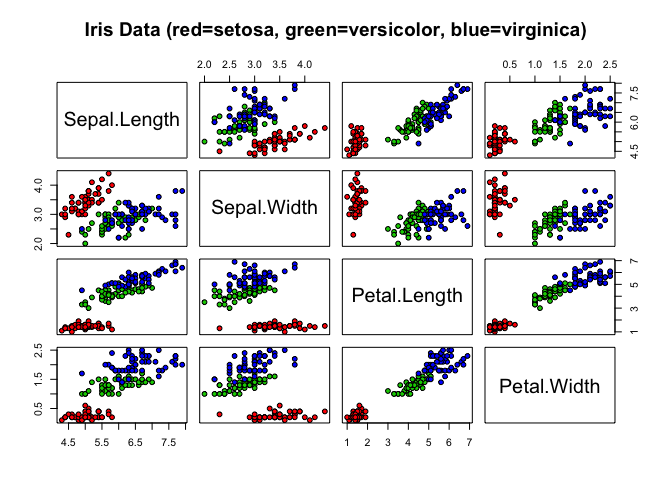

Feature Selection and Classification with Random Forest
================

## Read and Analyse Data

``` r
data(iris)
str(iris)
```

    ## 'data.frame':    150 obs. of  5 variables:
    ##  $ Sepal.Length: num  5.1 4.9 4.7 4.6 5 5.4 4.6 5 4.4 4.9 ...
    ##  $ Sepal.Width : num  3.5 3 3.2 3.1 3.6 3.9 3.4 3.4 2.9 3.1 ...
    ##  $ Petal.Length: num  1.4 1.4 1.3 1.5 1.4 1.7 1.4 1.5 1.4 1.5 ...
    ##  $ Petal.Width : num  0.2 0.2 0.2 0.2 0.2 0.4 0.3 0.2 0.2 0.1 ...
    ##  $ Species     : Factor w/ 3 levels "setosa","versicolor",..: 1 1 1 1 1 1 1 1 1 1 ...

``` r
summary(iris)
```

    ##   Sepal.Length    Sepal.Width     Petal.Length    Petal.Width   
    ##  Min.   :4.300   Min.   :2.000   Min.   :1.000   Min.   :0.100  
    ##  1st Qu.:5.100   1st Qu.:2.800   1st Qu.:1.600   1st Qu.:0.300  
    ##  Median :5.800   Median :3.000   Median :4.350   Median :1.300  
    ##  Mean   :5.843   Mean   :3.057   Mean   :3.758   Mean   :1.199  
    ##  3rd Qu.:6.400   3rd Qu.:3.300   3rd Qu.:5.100   3rd Qu.:1.800  
    ##  Max.   :7.900   Max.   :4.400   Max.   :6.900   Max.   :2.500  
    ##        Species  
    ##  setosa    :50  
    ##  versicolor:50  
    ##  virginica :50  
    ##                 
    ##                 
    ## 

## Visualization

``` r
pairs(iris[1:4], main = "Iris Data (red=setosa, green=versicolor, blue=virginica)",
       pch = 21, bg = c("red", "green3", "blue")[unclass(iris$Species)])
```

<!-- -->

## Feature Selection and Random Forest Classification

``` r
set.seed(42)
trainIndex <- createDataPartition(iris$Species, p = .8, list = FALSE)
trainData <- iris[ trainIndex,]
testData  <- iris[-trainIndex,]

model <- randomForest(Species ~ ., data=trainData)
print(model)
```

    ## 
    ## Call:
    ##  randomForest(formula = Species ~ ., data = trainData) 
    ##                Type of random forest: classification
    ##                      Number of trees: 500
    ## No. of variables tried at each split: 2
    ## 
    ##         OOB estimate of  error rate: 2.5%
    ## Confusion matrix:
    ##            setosa versicolor virginica class.error
    ## setosa         40          0         0       0.000
    ## versicolor      0         38         2       0.050
    ## virginica       0          1        39       0.025

``` r
pred <- predict(model, testData)
confusionMatrix(pred, testData$Species)
```

    ## Confusion Matrix and Statistics
    ## 
    ##             Reference
    ## Prediction   setosa versicolor virginica
    ##   setosa         10          0         0
    ##   versicolor      0          9         1
    ##   virginica       0          1         9
    ## 
    ## Overall Statistics
    ##                                           
    ##                Accuracy : 0.9333          
    ##                  95% CI : (0.7793, 0.9918)
    ##     No Information Rate : 0.3333          
    ##     P-Value [Acc > NIR] : 8.747e-12       
    ##                                           
    ##                   Kappa : 0.9             
    ##                                           
    ##  Mcnemar's Test P-Value : NA              
    ## 
    ## Statistics by Class:
    ## 
    ##                      Class: setosa Class: versicolor Class: virginica
    ## Sensitivity                 1.0000            0.9000           0.9000
    ## Specificity                 1.0000            0.9500           0.9500
    ## Pos Pred Value              1.0000            0.9000           0.9000
    ## Neg Pred Value              1.0000            0.9500           0.9500
    ## Prevalence                  0.3333            0.3333           0.3333
    ## Detection Rate              0.3333            0.3000           0.3000
    ## Detection Prevalence        0.3333            0.3333           0.3333
    ## Balanced Accuracy           1.0000            0.9250           0.9250

## Feature selection with correlation and random forest classification

``` r
# Compute correlation matrix and remove highly correlated variables
corMatrix <- cor(trainData[, -5])
highCorFeatures <- findCorrelation(corMatrix, cutoff = .7)
reducedTrainData <- trainData[, -highCorFeatures]

model2 <- randomForest(Species ~ ., data=reducedTrainData)
print(model2)
```

    ## 
    ## Call:
    ##  randomForest(formula = Species ~ ., data = reducedTrainData) 
    ##                Type of random forest: classification
    ##                      Number of trees: 500
    ## No. of variables tried at each split: 1
    ## 
    ##         OOB estimate of  error rate: 24.17%
    ## Confusion matrix:
    ##            setosa versicolor virginica class.error
    ## setosa         40          0         0       0.000
    ## versicolor      1         25        14       0.375
    ## virginica       0         14        26       0.350

``` r
reducedTestData <- testData[, -highCorFeatures]
pred2 <- predict(model2, reducedTestData)
confusionMatrix(pred2, testData$Species)
```

    ## Confusion Matrix and Statistics
    ## 
    ##             Reference
    ## Prediction   setosa versicolor virginica
    ##   setosa          9          0         0
    ##   versicolor      1          7         5
    ##   virginica       0          3         5
    ## 
    ## Overall Statistics
    ##                                          
    ##                Accuracy : 0.7            
    ##                  95% CI : (0.506, 0.8527)
    ##     No Information Rate : 0.3333         
    ##     P-Value [Acc > NIR] : 4.433e-05      
    ##                                          
    ##                   Kappa : 0.55           
    ##                                          
    ##  Mcnemar's Test P-Value : NA             
    ## 
    ## Statistics by Class:
    ## 
    ##                      Class: setosa Class: versicolor Class: virginica
    ## Sensitivity                 0.9000            0.7000           0.5000
    ## Specificity                 1.0000            0.7000           0.8500
    ## Pos Pred Value              1.0000            0.5385           0.6250
    ## Neg Pred Value              0.9524            0.8235           0.7727
    ## Prevalence                  0.3333            0.3333           0.3333
    ## Detection Rate              0.3000            0.2333           0.1667
    ## Detection Prevalence        0.3000            0.4333           0.2667
    ## Balanced Accuracy           0.9500            0.7000           0.6750

## Univariate feature selection and random forest classification

``` r
set.seed(42)
control <- rfeControl(functions=rfFuncs, method="cv", number=10)
results <- rfe(trainData[,1:4], trainData[,5], sizes=c(1:4), rfeControl=control)
print(results)
```

    ## 
    ## Recursive feature selection
    ## 
    ## Outer resampling method: Cross-Validated (10 fold) 
    ## 
    ## Resampling performance over subset size:
    ## 
    ##  Variables Accuracy  Kappa AccuracySD KappaSD Selected
    ##          1   0.9250 0.8875    0.07297 0.10945         
    ##          2   0.9750 0.9625    0.05625 0.08437        *
    ##          3   0.9667 0.9500    0.05827 0.08740         
    ##          4   0.9583 0.9375    0.05893 0.08839         
    ## 
    ## The top 2 variables (out of 2):
    ##    Petal.Length, Petal.Width

``` r
model3 <- randomForest(Species ~ ., data=trainData[,c(results$optVariables, "Species")])
pred3 <- predict(model3, testData[,c(results$optVariables, "Species")])
confusionMatrix(pred3, testData$Species)
```

    ## Confusion Matrix and Statistics
    ## 
    ##             Reference
    ## Prediction   setosa versicolor virginica
    ##   setosa         10          0         0
    ##   versicolor      0          9         1
    ##   virginica       0          1         9
    ## 
    ## Overall Statistics
    ##                                           
    ##                Accuracy : 0.9333          
    ##                  95% CI : (0.7793, 0.9918)
    ##     No Information Rate : 0.3333          
    ##     P-Value [Acc > NIR] : 8.747e-12       
    ##                                           
    ##                   Kappa : 0.9             
    ##                                           
    ##  Mcnemar's Test P-Value : NA              
    ## 
    ## Statistics by Class:
    ## 
    ##                      Class: setosa Class: versicolor Class: virginica
    ## Sensitivity                 1.0000            0.9000           0.9000
    ## Specificity                 1.0000            0.9500           0.9500
    ## Pos Pred Value              1.0000            0.9000           0.9000
    ## Neg Pred Value              1.0000            0.9500           0.9500
    ## Prevalence                  0.3333            0.3333           0.3333
    ## Detection Rate              0.3333            0.3000           0.3000
    ## Detection Prevalence        0.3333            0.3333           0.3333
    ## Balanced Accuracy           1.0000            0.9250           0.9250

## Recursive feature elimination (RFE) with random forest

``` r
control2 <- rfeControl(functions=rfFuncs, method="cv", number=10)
results2 <- rfe(trainData[,1:4], trainData[,5], sizes=c(1:4), rfeControl=control2)
print(results2)
```

    ## 
    ## Recursive feature selection
    ## 
    ## Outer resampling method: Cross-Validated (10 fold) 
    ## 
    ## Resampling performance over subset size:
    ## 
    ##  Variables Accuracy  Kappa AccuracySD KappaSD Selected
    ##          1   0.9250 0.8875    0.06149 0.09223         
    ##          2   0.9750 0.9625    0.07906 0.11859        *
    ##          3   0.9667 0.9500    0.08051 0.12076         
    ##          4   0.9667 0.9500    0.08051 0.12076         
    ## 
    ## The top 2 variables (out of 2):
    ##    Petal.Length, Petal.Width

``` r
model4 <- randomForest(Species ~ ., data=trainData[,c(results2$optVariables, "Species")])
pred4 <- predict(model4, testData[,c(results2$optVariables, "Species")])
confusionMatrix(pred4, testData$Species)
```

    ## Confusion Matrix and Statistics
    ## 
    ##             Reference
    ## Prediction   setosa versicolor virginica
    ##   setosa         10          0         0
    ##   versicolor      0          9         1
    ##   virginica       0          1         9
    ## 
    ## Overall Statistics
    ##                                           
    ##                Accuracy : 0.9333          
    ##                  95% CI : (0.7793, 0.9918)
    ##     No Information Rate : 0.3333          
    ##     P-Value [Acc > NIR] : 8.747e-12       
    ##                                           
    ##                   Kappa : 0.9             
    ##                                           
    ##  Mcnemar's Test P-Value : NA              
    ## 
    ## Statistics by Class:
    ## 
    ##                      Class: setosa Class: versicolor Class: virginica
    ## Sensitivity                 1.0000            0.9000           0.9000
    ## Specificity                 1.0000            0.9500           0.9500
    ## Pos Pred Value              1.0000            0.9000           0.9000
    ## Neg Pred Value              1.0000            0.9500           0.9500
    ## Prevalence                  0.3333            0.3333           0.3333
    ## Detection Rate              0.3333            0.3000           0.3000
    ## Detection Prevalence        0.3333            0.3333           0.3333
    ## Balanced Accuracy           1.0000            0.9250           0.9250

## Feature Extraction with PCA

``` r
pca <- prcomp(trainData[, -5], center = TRUE, scale. = TRUE)
trainData_pca <- data.frame(pca$x, Species = trainData$Species)

model5 <- randomForest(Species ~ ., data=trainData_pca)
print(model5)
```

    ## 
    ## Call:
    ##  randomForest(formula = Species ~ ., data = trainData_pca) 
    ##                Type of random forest: classification
    ##                      Number of trees: 500
    ## No. of variables tried at each split: 2
    ## 
    ##         OOB estimate of  error rate: 4.17%
    ## Confusion matrix:
    ##            setosa versicolor virginica class.error
    ## setosa         40          0         0       0.000
    ## versicolor      0         39         1       0.025
    ## virginica       0          4        36       0.100

``` r
testData_pca <- data.frame(predict(pca, newdata = testData[, -5]), Species = testData$Species)
pred5 <- predict(model5, testData_pca)
confusionMatrix(pred5, testData$Species)
```

    ## Confusion Matrix and Statistics
    ## 
    ##             Reference
    ## Prediction   setosa versicolor virginica
    ##   setosa         10          0         0
    ##   versicolor      0         10         2
    ##   virginica       0          0         8
    ## 
    ## Overall Statistics
    ##                                           
    ##                Accuracy : 0.9333          
    ##                  95% CI : (0.7793, 0.9918)
    ##     No Information Rate : 0.3333          
    ##     P-Value [Acc > NIR] : 8.747e-12       
    ##                                           
    ##                   Kappa : 0.9             
    ##                                           
    ##  Mcnemar's Test P-Value : NA              
    ## 
    ## Statistics by Class:
    ## 
    ##                      Class: setosa Class: versicolor Class: virginica
    ## Sensitivity                 1.0000            1.0000           0.8000
    ## Specificity                 1.0000            0.9000           1.0000
    ## Pos Pred Value              1.0000            0.8333           1.0000
    ## Neg Pred Value              1.0000            1.0000           0.9091
    ## Prevalence                  0.3333            0.3333           0.3333
    ## Detection Rate              0.3333            0.3333           0.2667
    ## Detection Prevalence        0.3333            0.4000           0.2667
    ## Balanced Accuracy           1.0000            0.9500           0.9000

## Conclusion

In this project, we conducted various feature selection methods and
classification using the Random Forest algorithm on the iris dataset. We
observed how different feature selection strategies, such as
correlation-based feature selection and univariate feature selection,
influenced the performance of the Random Forest model.

The results highlighted the importance of selecting the right features
for improving the accuracy and performance of a machine learning model.
In some cases, reducing the number of features can lead to comparable,
if not better, model performance.

We also explored how feature extraction using PCA affects the model.
It’s worth noting that the effectiveness of PCA largely depends on the
dataset, and it might not always improve the model’s performance.

Lastly, the use of the caret package in R provided us with powerful and
efficient functions for model training and feature selection.

As with any machine learning project, the approaches and findings in
this analysis are dataset-specific. It’s crucial to perform similar
analyses and adapt the methodology based on the specific requirements
and properties of different datasets in real-world projects.
